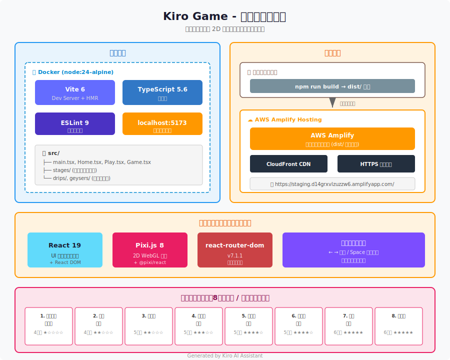

# 愛媛県へようこそ！ 〜あれ、観光名所の様子が...？〜


画面切り替え型 2D プラットフォーマーゲーム。Kiro (AI アシスタント) によって生成されたプロジェクトです。

## デモ

<div><video controls src="https://github.com/user-attachments/assets/96a54630-1e11-4b93-9c67-90f2f46a83ab.mp4" muted="false"></video></div>

## 追加機能

### クリア時の演出
- **クリアメッセージ表示** — ステージごとに複数行のメッセージを表示（`\n` で改行対応）
- **結果ツイート共有** — 死亡数・タイムを含めた結果を X (Twitter) に投稿
- **Google Maps 経路案内** — クリア後に「📍 聖地に行ってみる」ボタンで現在地→目的地の経路を表示（経由地指定も可能）

### ゲームプレイ補助
- **AI アドバイス** — ゲームオーバー時にスクリーンショットを解析し、攻略のヒントを自動表示
- **タイマー表示** — リアルタイムでプレイ時間を計測・表示
- **Now Loading 画面** — アセット読み込み中のローディング表示

### ギミック
- **間欠泉** — 一定間隔で噴出し、噴出中のみ当たり判定あり（トリガー指定も可能）
- **雫トラップ** — 上から周期的に落下する障害物
- **移動するハザード** — ステージ 5 以降で敵が左右に自動移動

### 画面・描画
- **4:3 横画面固定比率** — ウィンドウサイズに応じてレスポンシブにフィット
- **背景画像全面表示** — 各画面ごとに 4:3 の背景画像を最背面に配置
- **画面ごとのハザード設定** — 画面単位でハザード画像・サイズを切り替え可能

## ステージ一覧

| # | 名前 | 画面数 | 難易度 |
|---|------|--------|--------|
| 1 | 四国中央・新居浜 | 4 | ★☆☆☆☆ |
| 2 | 今治・西条 | 4 | ★★☆☆☆ |
| 3 | お祭り | 5 | ★★☆☆☆ |
| 4 | その他中予 | 5 | ★★★☆☆ |
| 5 | その他南予 | 6 | ★★★★☆ |
| 6 | 宇和島・愛南 | 4 | ★★★★☆ |
| 7 | 道後温泉 | 6 | ★★★★★ |
| 8 | 松山城 | 6 | ★★★★★ |

## 開発環境

Docker を使用して開発環境を構築しています。ホストに Node.js がなくても動作します。

### 初回セットアップ

```bash
docker compose build
docker compose run --rm app npm install
docker compose up -d
```

### コマンド

```bash
# 開発サーバー起動
docker compose up -d

# ログ確認
docker compose logs -f

# 停止
docker compose down

# パッケージ追加
docker compose run --rm app npm install <パッケージ名>

# package.json 変更後
docker compose run --rm app npm install

# Lint
docker compose run --rm app npm run lint

# コンテナに入る
docker compose exec app sh

# Dockerfile.dev 変更時
docker compose up -d --build

# node_modules を作り直す
docker compose down -v
docker compose build
docker compose run --rm app npm install
docker compose up -d
```

### アクセス URL

http://localhost:5173/

### 操作方法

- `←` `→` : 左右移動
- `Space` : ジャンプ

画面右端に到達すると次の画面に切り替わり、左端に到達すると前の画面に戻ります。

## 本番環境

マルチステージビルドで静的ファイルを生成し、nginx で配信します。

### ビルド & 起動

```bash
docker compose -f docker-compose.prod.yml up -d --build
```

### 停止

```bash
docker compose -f docker-compose.prod.yml down
```

### アクセス URL

http://localhost/

## Docker 構成

| ファイル | 用途 |
|---|---|
| `Dockerfile.dev` | 開発用（node:24-alpine） |
| `Dockerfile` | 本番用（node:24-alpine → nginx:alpine） |
| `docker-compose.yml` | 開発用オーケストレーション |
| `docker-compose.prod.yml` | 本番用オーケストレーション |

## 技術スタック

### ランタイム / フレームワーク

| ライブラリ | バージョン | 用途 |
|---|---|---|
| React | 19.0.0 | UI フレームワーク |
| React DOM | 19.0.0 | DOM レンダリング |
| react-router-dom | 7.1.1 | ページルーティング |
| Pixi.js | 8.2.6 | 2D WebGL 描画エンジン |
| @pixi/react | 8.0.2 | Pixi.js の React バインディング |

### 開発ツール

| ツール | バージョン | 用途 |
|---|---|---|
| TypeScript | 5.6.3 | 型安全な開発 |
| Vite | 6.0.1 | ビルド / 開発サーバー |
| ESLint | 9.15.0 | コード品質チェック |
| Docker (node:24-alpine) | - | 開発・ビルド環境 |
| nginx (alpine) | - | 本番静的配信 |

## システム構成


## Kiro について

このプロジェクトは [Kiro](https://kiro.dev) (AI コーディングアシスタント) との対話により設計・実装されました。プロジェクト構成、ライブラリ選定、ゲームロジックのすべてが AI との協業で生成されています。
